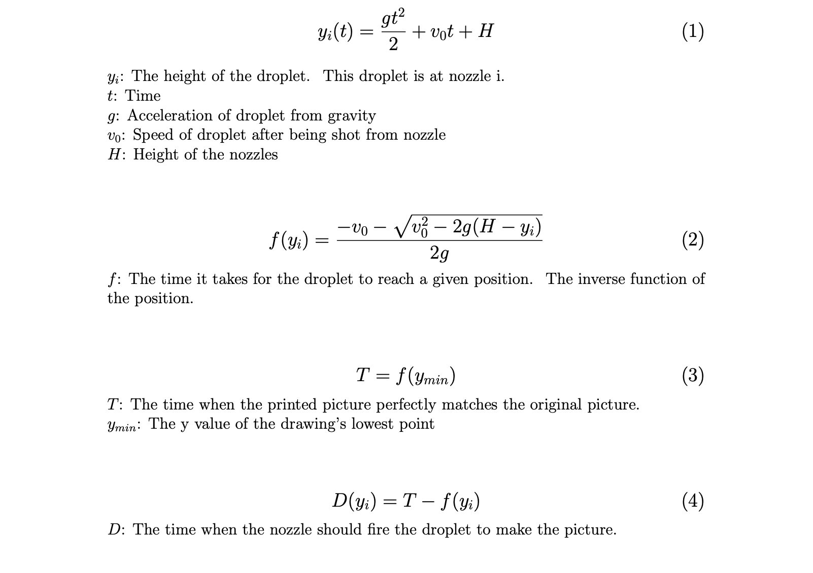
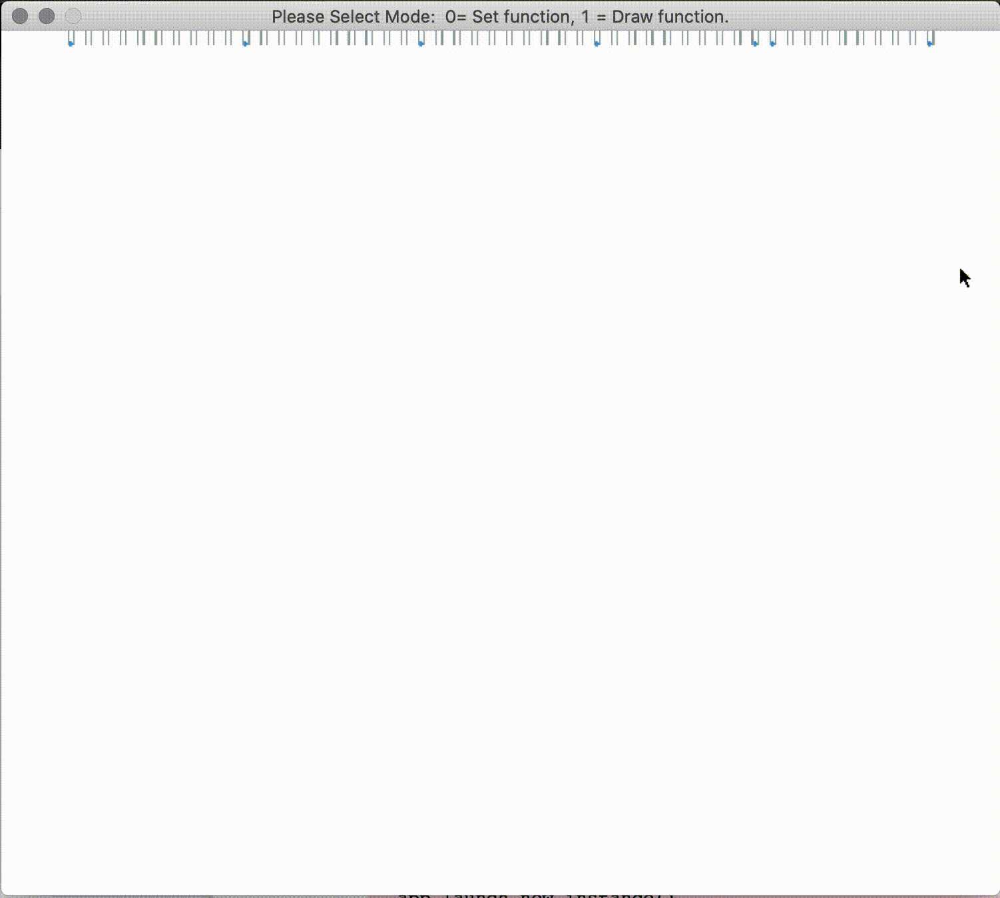
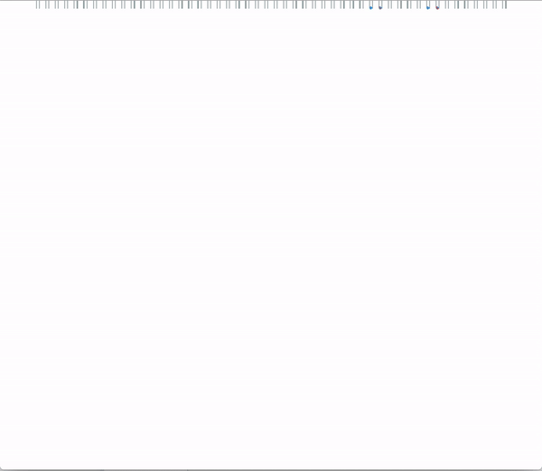

# Water Clock Simulation

I created a simple simulation a year ago to replicate a water fountain that prints pictures and designs.

## Intro
I was inspired by the Osaka Station Water Clock, a fountain that displays the current time with water.  The fountain is a line of programmable nozzles that creates a curtain of water.  They can be programmed to draw shapes, pictures, and designs by controlling when a nozzle fires water at a specific time.

Here lies an interesting problem: how does one program the nozzles to print out a shape?  A solution is more difficult than it appears.  Notice how all of the shapes start do stretch as they fall.  This is because the bottom part of the shape is in freefall for a longer time than the top part of the shape, meaning that gravity pulls the lower half down for a longer time.  The bottom portion picks up more speed and falls faster than the top part, creating a distortion as the shape is being printed.  The difference in speeds of the water droplets also cause the picture to elongate as time passes, so even if a perfect circle is drawn, it will immediately start to lengthen and become an oval.

So how do you draw it?  I sought to find out how can one draw a picture and have it be perfectly replicated without distortion.

## Simulation
I coded my progam in python using a Jupyter notebook.  I used pymunk and pyGame to simulate a 2d version of the fountain.  Water droplets were small circles that were influenced by gravity (no cohesion or air resistance considered.)  My application has 2 modes: a preprogrammed picture (list of points), and a drawing mode.  For the drawing mode, I used the pygame event listeners to allow users to draw their own picture by recording the positions of their cursor.

## Computation
To convert a drawing to commands to print the picture, we convert the drawing into a list of 2d points.  For one point with values (x,y), we take the x and map it to a number n that tells the fountain to fire the nth nozzle: the droplets on the left are taken care of the nozzles on the left.  The y value, the height of the droplet, tells us something else.  

We map the y values to the time when the nozzles should fire the droplets.  The program will take a pair of numbers: i, telling the program to fire the ith nozzle, and D, the time to fire the nozzle.  Since gravity is the only force acting upon the droplets, their position function is a typical quadratic with respect to time (Eq. 1.)  We then find the inverse function of the position, f, giving us the time it takes for the droplet to fall to a given position (Eq. 2.)  We then calculate the time where the droplet picture matches the original drawing, which can be given by using the inverse function of the y value of the lowest point of the drawing.  We name this time T (Eq. 3.)  We find the time to fire the nozzle, called D, equal to T minus the inverse function of the height of the droplet (Eq. 4.)

My program records the initial drawing as a list of 2d points, each with an x and y value.  The program converts the x into a number i that indicates which nozzle to use.  It converts the y into D(y), the proper time to fire the droplet.  It then takes this new list of pairs of i and D(y), sorts it by time, and commences the drawing program that records the elapsed time, firing a droplet at nozzle i at the specified time D(y).

## Application
Preset drawings are made.  The user can draw their own picture and see if the droplets match the shape exactly.

